# 一、实验目的

1. 掌握傅里叶变换正反变换的定义及求解方法； 

2. 掌握非周期信号的频谱密度函数的求解方法，并用Matlab绘制频谱图； 

3. 掌握频域系统函数的概念和物理意义； 

4. 利用Matlab实现连续时间系统的频域分析。 

# 二、实验原理 

略，见指导文档文档

# 三、实验设备（环境）
操作系统Windows11/10/9/8/7  
编程软件：推荐Matlab，版本不低于2016版本。

# 四、实验内容 

## 实验1：非周期信号的FT实验 

1. 利用符号求解方法，求 $e^{-t}\epsilon(t)$的傅里叶变换，并绘制其频谱（幅度谱和相位谱）。 
  **FT结果：**

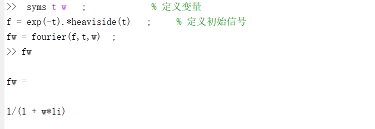 
**频谱图**

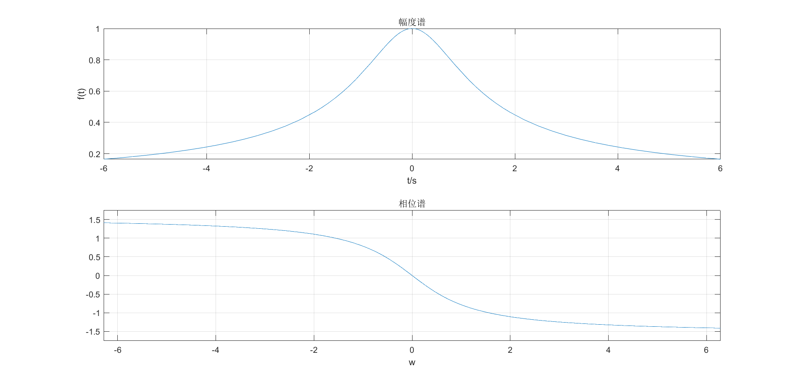
**源代码**
```markdown
syms t w   ;             % 定义变量
f = exp(-t).*heaviside(t)   ;     % 定义初始信号    
fw = fourier(f,t,w)  ; 
subplot(211),
fplot(abs(fw),[-6,6]) ;  
grid on  ; % 加网格
xlabel('t/s')  ;
ylabel('f(t)') ;
title('幅度谱');

phase = atan(imag(fw)/real(fw));
subplot(212),ezplot(phase);grid on,title('相位谱')

```


2. 利用符号求解方法，求$\frac{1}{\omega ^2+1}$的傅里叶反变换，并绘制其波形图。 
**IFT结果**

**频谱图**
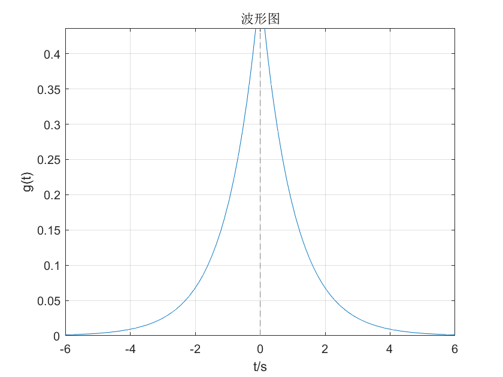
**源代码**
```markdown
syms t w   ;           
f = 1/(1 + w^2)   ;    
g = ifourier(f,t)  ; 

fplot(g,[-6,6]) ;  
grid on  ; % 加网格
xlabel('t/s')  ;
ylabel('g(t)') ;
title('波形图');


```


3. 用数值计算的方法，求$e^{-t}\epsilon(t)$的傅里叶变换，并绘制其频谱（幅度谱和相位谱）。就幅度谱，将数值解与理论值进行对比，观察误差，思考提升数值计算精度的方法。 
**频谱图**
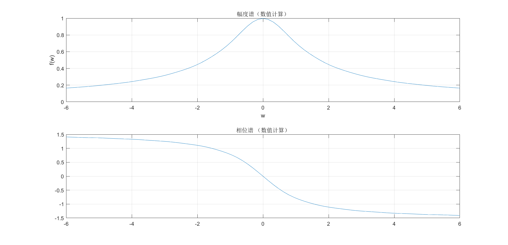
**源代码**
```markdown
dt=0.01;
t=-6:dt:6;
ft=exp(-t).*heaviside(t);
N=2000;
k=-N:N;
w=pi*k/(N*dt);
fw=dt*ft*exp(-1i*t'*w);
phase = angle(fw); 
fw=abs(fw);

subplot(211),
plot(w,fw),grid on
axis([-6 6 0 1])
xlabel('w'),ylabel('f(w)')
title('幅度谱（数值计算）');
subplot(212),
plot(w,phase),
axis([-6 6 -1.5 1.5])
grid on,
title('相位谱 （数值计算）');

```
**数值解与理论解对比**


**源代码**
```markdown
dt=0.01;
t=-6:dt:6;
ft=exp(-t).*heaviside(t);
N=2000;
k=-N:N;
w=pi*k/(N*dt);
fw=dt*ft*exp(-1i*t'*w);
phase = angle(fw); 
fw=abs(fw);
subplot(211),
plot(w,fw),grid on
axis([-6 6 0 1])
xlabel('w'),ylabel('f(w)')
title('幅度谱（数值计算）');

subplot(212),
syms t1 w   ;             % 定义变量
f = exp(-t1).*heaviside(t1)   ;     % 定义初始信号    
fw1 = fourier(f,t1,w)  ; 
fplot(abs(fw1),[-6,6]) ;  
grid on  ; % 加网格
axis([-6 6 0 1])
xlabel('t/s')  ;
ylabel('f(t)') ;
title('幅度谱(理论)');
```
**精度提升方法**
增加主要取值区间内所抽取的点的个数，使其尽可能的大。

## 实验2：傅里叶变换性质验证实验（**要求**采用数值求解方法进行FT） 

1. （奇偶特性）分别画出$G_4(t)$、$\Lambda _4(t)$、$e^{-t}\epsilon(t)$、$e^{-t}\epsilon(t)- e^{t}\epsilon(-t)$的时域波形图及其幅度谱和相位谱。结合图像，给出奇偶特性相关结论。 
* $G_4(t)$
 **频谱图**
  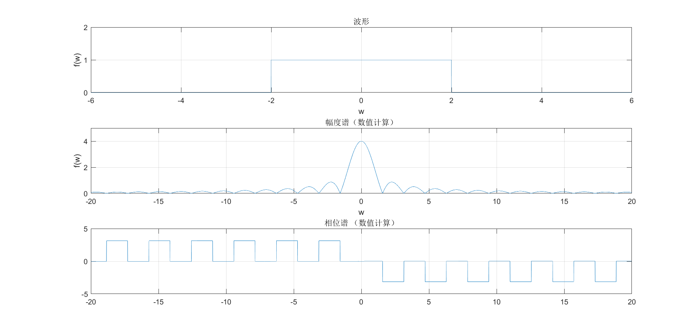
  **源代码**
 ```markdown
clc;
dt=1e-3;
t=-10:dt:10;
ft=rectpuls(0.25*t);
N=20;
k=-N:0.01:N;
[W,T] = meshgrid(k,t);
fw=dt*ft*exp(-1i*T.*W);
phase = angle(fw); 
fw=abs(fw);

subplot(311),
plot(t,ft),grid on
axis([-6 6 0 2])
xlabel('w'),ylabel('f(w)')
title('波形');
subplot(312),
plot(w,fw),grid on
axis([-20 20 0 5])
xlabel('w'),ylabel('f(w)')
title('幅度谱（数值计算）');
subplot(313),
plot(w,phase),
axis([-20 20 -5 5 ])
grid on,
title('相位谱 （数值计算）');
 ```
* $\Lambda _4(t)$
  **频谱图**
   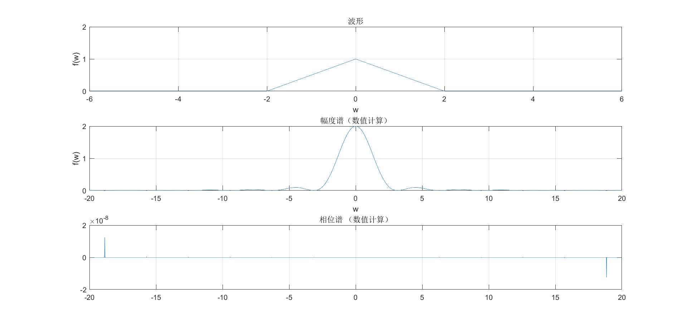
  **源代码** 
  
  ```markdown
  clc;
  dt=1e-3;
  t=-10:dt:10;
  ft=tripuls(0.25*t);
  N=20;
  k=-N:0.01:N;
  [W,T] = meshgrid(k,t);
  fw=dt*ft*exp(-1i*T.*W);
  phase = angle(fw); 
  fw=abs(fw);
  
  subplot(311),
  plot(t,ft),grid on
  axis([-6 6 0 2])
  xlabel('w'),ylabel('f(w)')
  title('波形');
  subplot(312),
  plot(w,fw),grid on
  axis([-20 20 0 2])
  xlabel('w'),ylabel('f(w)')
  title('幅度谱（数值计算）');
  subplot(313),
  plot(w,phase),
  grid on,
  title('相位谱 （数值计算）');

* $e^{-t}\epsilon(t)$
  **频谱图**
  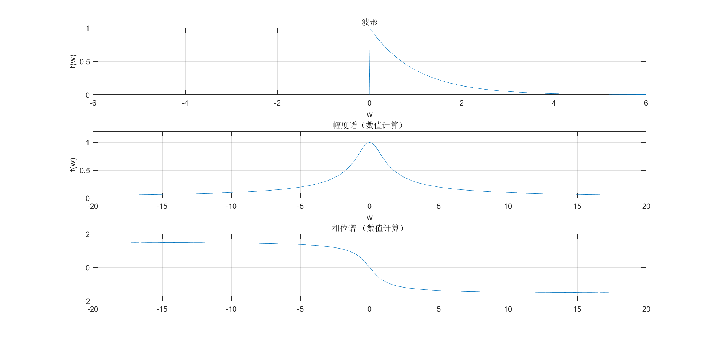
  **源代码**

```
dt=0.01;
t=-6:dt:6;
ft=exp(-t).*heaviside(t);
N=2000;
k=-N:N;
w=pi*k/(N*dt);
fw=dt*ft*exp(-1i*t'*w);
phase = angle(fw); 
fw=abs(fw);

subplot(311),
plot(t,ft),grid on
axis([-6 6 0 1])
xlabel('w'),ylabel('f(w)')
title('波形');
subplot(312),
plot(w,fw),grid on
axis([-20 20 0 1.2])
xlabel('w'),ylabel('f(w)')
title('幅度谱（数值计算）');
subplot(313),
plot(w,phase),
axis([-20 20 -2 2 ])
grid on,
title('相位谱 （数值计算）');
```
* $e^{-t}\epsilon(t)- e^{t}\epsilon(-t)$
  **频谱图**
  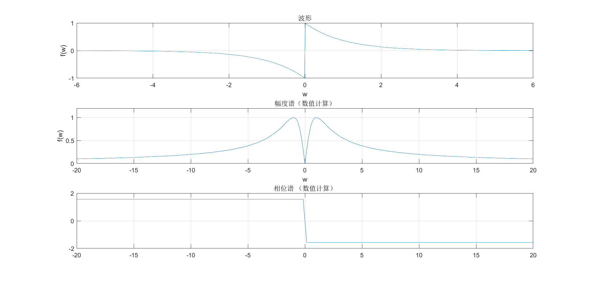
  **源代码**
```markdown
dt=0.01;
t=-6:dt:6;
ft=exp(-t).*heaviside(t)-exp(t).*heaviside(-t);
N=2000;
k=-N:N;
w=pi*k/(N*dt);
fw=dt*ft*exp(-1i*t'*w);
phase = angle(fw); 
fw=abs(fw);

subplot(311),
plot(t,ft),grid on
axis([-6 6 -1 1])
xlabel('w'),ylabel('f(w)')
title('波形');
subplot(312),
plot(w,fw),grid on
axis([-20 20 0 1.2])
xlabel('w'),ylabel('f(w)')
title('幅度谱（数值计算）');
subplot(313),
plot(w,phase),
axis([-20 20 -2 2 ])
grid on,
title('相位谱 （数值计算）');
```
**结论**
偶信号的频谱是偶函数，奇信号的频谱是奇函数。
2. （展缩特性）假设$x(t)=G_4(t)$，分别画出$x(t)$，$x(t/2)$，$x(2t)$的时域波形图及其幅度谱和相位谱。结合图像，给出展缩特性相关结论。 
    **频谱图**
    
    **源代码**
  ```markdown
clc;
dt=1e-3;
t=-10:dt:10;
ft=rectpuls(0.25*t);
ft1=rectpuls(0.5*t);
ft2=rectpuls(0.125*t); 
N=20;
k=-N:0.01:N;
[W,T] = meshgrid(k,t);
fw=dt*ft*exp(-1i*T.*W);
fw1=dt*ft1*exp(-1i*T.*W);
fw2=dt*ft2*exp(-1i*T.*W);
phase = angle(fw);
phase1 = angle(fw1);
phase2 = angle(fw2);
fw=abs(fw);
fw1=abs(fw1);
fw2=abs(fw2);

subplot(311),
plot(t,ft,t,ft1,t,ft2,'.-'),legend('x(t)','x(t/2)','x(2t)')
grid on
axis([-6 6 0 1.5])
xlabel('w'),ylabel('f(w)')
title('波形');
subplot(312),
plot(w,fw,w,fw1,w,fw2,'.-'),legend('x(t)','x(t/2)','x(2t)')
grid on
axis([-20 20 0 10])
xlabel('w'),ylabel('f(w)')
title('幅度谱（数值计算）');
subplot(313),
plot(w,phase,w,phase1,w,phase2,'.-'),legend('x(t)','x(t/2)','x(2t)')
axis([-20 20 -5 5 ])
grid on,
title('相位谱 （数值计算）');
  ```
  **结论：**
  一个信号的时域压缩就导致它的频谱扩展，而它的时域扩展导致它的频谱压缩。
3. （时移特性）假设$x(t)=\Lambda_4(t)$，分别画出$x(t)$，$x(t-0.1)$，$x(t-1)$的时域波形图及其幅度谱和相位谱。结合图像，给出时移特性相关结论。 
    **频谱图**
    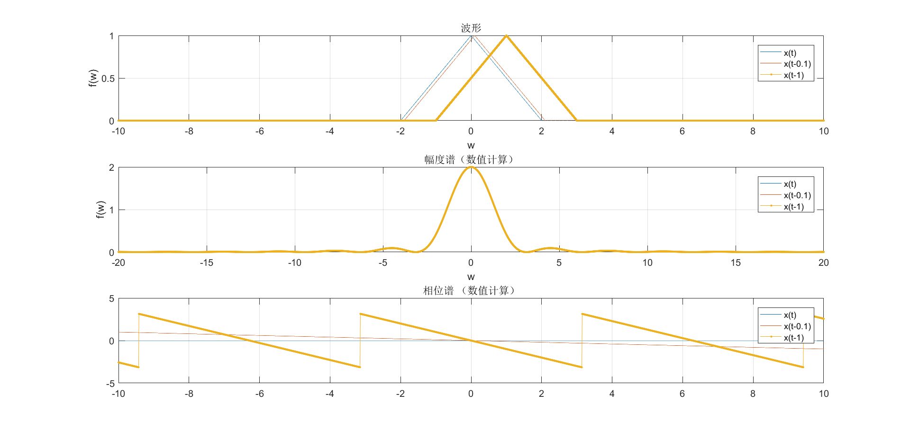
    **源代码**
  ```markdown
clc;
dt=1e-3;
t=-10:dt:10;
ft=tripuls(0.25*t);
ft1=tripuls(0.25*(t-0.1));
ft2=tripuls(0.25*(t-1)); 
N=20;
k=-N:0.01:N;
[W,T] = meshgrid(k,t);
fw=dt*ft*exp(-1i*T.*W);
fw1=dt*ft1*exp(-1i*T.*W);
fw2=dt*ft2*exp(-1i*T.*W);
phase = angle(fw);
phase1 = angle(fw1);
phase2 = angle(fw2);
fw=abs(fw);
fw1=abs(fw1);
fw2=abs(fw2);

subplot(311),
plot(t,ft,t,ft1,t,ft2,'.-'),legend('x(t)','x(t-0.1)','x(t-1)')
grid on
xlabel('w'),ylabel('f(w)')
title('波形');
subplot(312),
plot(w,fw,w,fw1,w,fw2,'.-'),legend('x(t)','x(t-0.1)','x(t-1)')
grid on
xlabel('w'),ylabel('f(w)')
title('幅度谱（数值计算）');
subplot(313),
plot(w,phase,w,phase1,w,phase2,'.-'),legend('x(t)','x(t-0.1)','x(t-1)')
axis([-10 10 -5 5 ])
grid on,
title('相位谱 （数值计算）');
  ```
**结论：**
序列信号 在 " 时间 " 上 , 进行一系列 " 平移 " 之后 ,较大改变了序列信号傅里叶变换 的 " 相频特性 "，因为由于时间延迟，信号中所有频率分量都出现了一个负相位，因子每个频率的负相位与该频率成线性关系；没有改变序列信号傅里叶变换 的 " 幅频特性 " 。
4. （频移特性）假设$x(t)=G_4(t)$，分别画出$x(t)$，$x(t)\cos(20t)$的时域波形图及其频谱图。结合图像，给出频移特性相关结论。 
**频谱图**
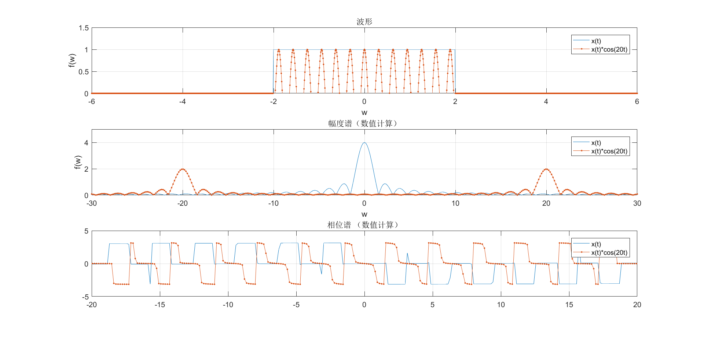
**源代码**
```markdown
clc;
dt=1e-3;
t=-10:dt:10;
ft=rectpuls(0.25*t);
ft1=rectpuls(0.25*t).*cos(20*t);
N=20;
k=-N:0.01:N;
[W,T] = meshgrid(k,t);
fw=dt*ft*exp(-1i*T.*W);
fw1=dt*ft1*exp(-1i*T.*W);
phase = angle(fw);
phase1 = angle(fw1);
fw=abs(fw);
fw1=abs(fw1);

subplot(311),
plot(t,ft,t,ft1,'.-'),legend('x(t)','x(t)*cos(20t)')
grid on
axis([-6 6 0 1.5])
xlabel('w'),ylabel('f(w)')
title('波形');
subplot(312),
plot(w,fw,w,fw1,'.-'),legend('x(t)','x(t)*cos(20t)')
grid on
xlabel('w'),ylabel('f(w)')
title('幅度谱（数值计算）');
subplot(313),
plot(w,phase,w,phase1,'.-'),legend('x(t)','x(t)*cos(20t)')
grid on,
title('相位谱 （数值计算）');
```
**结论：**
时域上乘以复指数函数 $e^{j\omega_0 t}$，相当于所有旋转向量的旋转速度都增加了$\omega_0$，旋转角速度变为$\omega+\omega_0$。
## 实验3：连续时间系统频域分析实验 

1. 已知某系统微分方程为：${y}''(t)+{y}'(t)+y(t)=x(t)$，画出该系统的幅频和相频响应曲线。 
**频谱图**
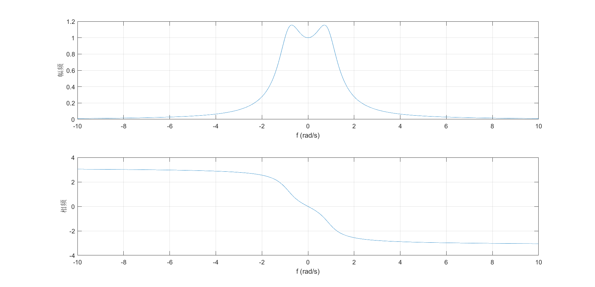
**源代码**
```markdown
a=[1 1 1];
b=[0 1];
dt=0.01;
w = -10:dt:10;
h = freqs(b,a,w);
fw = abs(h);
pw = angle(h);
subplot(211), plot(w,fw), grid on
xlabel ('f (rad/s)'), ylabel('幅频')
subplot(212), 
plot(w,pw), grid on
xlabel ('f (rad/s)'), ylabel( '相频')
```
2. 对于上题中的二阶系统，当输入信号为$f(t)=\cos t+\cos(10t)$时，求系统输出$y(t)$，绘制时域波形。结合实验结果，分析该系统的滤波特性。 
**波形图**
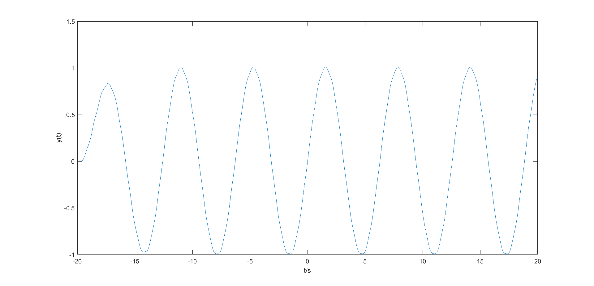
**源代码**
```markdown
a = [ 1 1 1];
b = [0 1];
sys = tf(b,a); % 获取系统模型
t = -20:0.01:20; % 对时间 t 进行离散抽样
ft = cos(t)+cos(10*t);
y = lsim(sys,ft,t);
plot(t,y);
xlabel('t/s')
ylabel('y(t)')
```
**滤波特性**:
通过对系统函数的幅频和相频曲线的分析可知该系统是一个低通滤波器。

#  五、实验体会、感悟和总结
本次实验有很多题涉及到用数值方法FT并绘制频谱图，个人认为其中一个比较麻烦的点是调参，即离散点的间隔和数量的设置。经测试不同的参数下绘制出的图像结果也不一样，因此容易出现不同的同学画的图都不一样的情况，那会让人不确定自己的答案是否正确。
至于感悟，最大的感悟就是做实验理论得先搞清楚，否则容易做的很痛苦。
